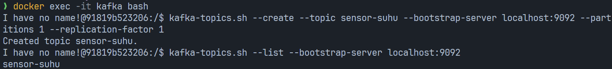
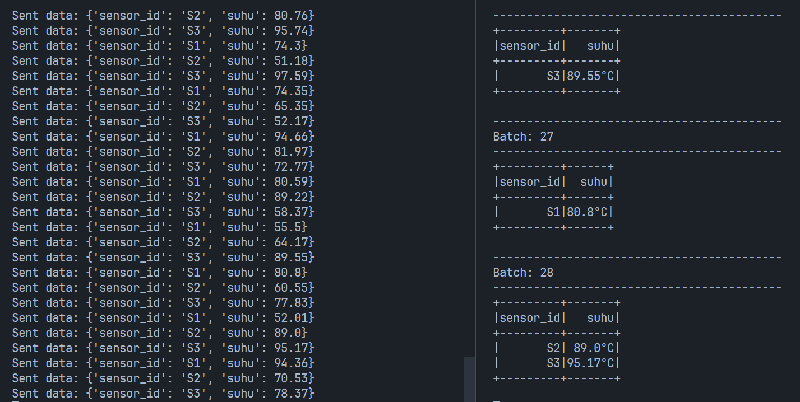

# Apache Kafka Study Case

Kelompok:

- Muhammad Harvian Dito Syahputra (5027221039)
- Naufan Zaki Luqmanulhakim (5027221065)

Study Case:

- Pabrik membutuhkan aliran data sensor yang dapat diteruskan ke layanan analitik atau dashboard secara langsung.
- Apache Kafka akan digunakan untuk menerima dan mengalirkan data suhu, sementara PySpark akan digunakan untuk mengolah dan memfilter data tersebut.

Tugas:

1. Buat Topik Kafka untuk Data Suhu:

- Buat topik di Apache Kafka bernama "sensor-suhu" yang akan menerima data suhu dari sensor-sensor mesin.

2. Simulasikan Data Suhu dengan Producer:

- Buat producer sederhana yang mensimulasikan data suhu dari beberapa sensor mesin (misalnya, 3 sensor berbeda).
- Setiap data suhu berisi ID sensor dan suhu saat ini (misalnya, sensor_id: S1, suhu: 70°C), dan dikirim setiap detik ke topik "sensor-suhu".

3. Konsumsi dan Olah Data dengan PySpark:

- Buat consumer di PySpark yang membaca data dari topik "sensor-suhu".
- Filter data suhu yang berada di atas 80°C, sebagai indikator suhu yang perlu diperhatikan.

4. Output dan Analisis:

- Cetak data yang suhu-nya melebihi 80°C sebagai tanda peringatan sederhana di console.

## Setup Apache Kafka dan Zookeeper

Installasi Apache Kafka dan Zookeeper dilakukan dengan menggunakan docker. Berikut file `docker-compose.yaml`.

```yaml
services:
  zookeeper:
    image: "bitnami/zookeeper:latest"
    container_name: zookeeper
    environment:
      - ALLOW_ANONYMOUS_LOGIN=yes
    ports:
      - "2181:2181"

  kafka:
    image: "bitnami/kafka:latest"
    container_name: kafka
    environment:
      - KAFKA_BROKER_ID=1
      - KAFKA_ZOOKEEPER_CONNECT=zookeeper:2181
      - ALLOW_PLAINTEXT_LISTENER=yes
      - KAFKA_LISTENERS=PLAINTEXT://:9092
      - KAFKA_ADVERTISED_LISTENERS=PLAINTEXT://localhost:9092
    ports:
      - "9092:9092"
    depends_on:
      - zookeeper
```

Langkah pertama adalah menjalankan command berikut untuk melakukan build docker

```bash
docker-compose up --build
```

Setelah docker container berhasil dibuat, maka langkah selanjutnya adalah membuat topic kafka

## Membuat Topik Kafka

Untuk membuat topic, bisa menggunakan command berikut

```bash
docker exec -it kafka bash
```

Setelah masuk ke dalam container kafka, maka langkah selanjutnya adalah membuat topic

```bash
kafka-topics.sh --create --topic sensor-suhu --bootstrap-server localhost:9092 --partitions 1 --replication-factor 1
```

Topic yang dibuat berdasarkan soal adalah sensor-suhu. Kemudian dapat melakukan command berikut untuk check apakah topic sudah terbuat atau belum

```bash
kafka-topics.sh --list --bootstrap-server localhost:9092
```

Contoh:


Jika topic sudah terbuat, maka seharusnya akan muncul list nama topic

## Simulasi Study Case

Menjalankan program producer

```bash
python3 kafka-producer.py
```

Menjalankan program consumer di terminal lain

```bash
python3 pyspark_consumer.py
```

Hasil:

